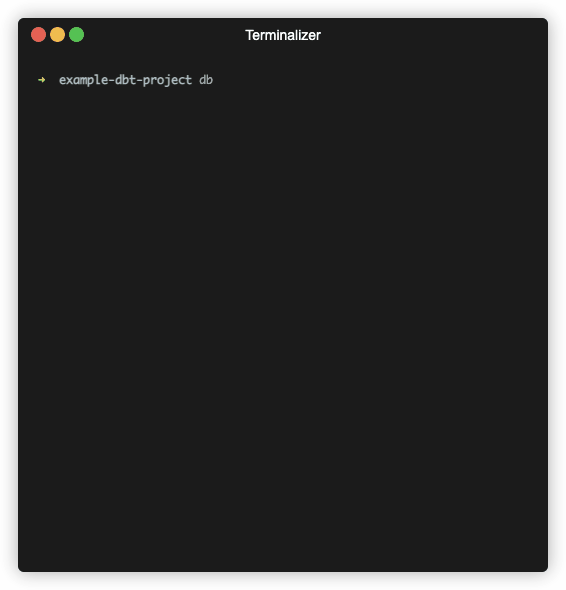

# dbt-cloud-sync

dbt infrastructure-as-code that is friendly to analysts, bizops, etc




## Motivation

While there are Terraform plugins that can be used to work with `dbt Cloud` jobs, environments, etc, we wanted a simple way to be able to create/modify/delete jobs within the same repository in a readable way that doesn't require any DevOps knowledge.

## Usage

```bash
➜ dbt-cloud-sync
Usage: dbt-cloud-sync [OPTIONS] [COMMAND]

Commands:
  plan
  apply
  help   Print this message or the help of the given subcommand(s)

Options:
  -d, --debug...  Turn debugging information on
  -h, --help      Print help
  -V, --version   Print version
```

In order to run, `dbt-cloud-sync` expects to environment variables to be set:

```bash
DBT_CLOUD_ACCOUNT_ID=123
DBT_CLOUD_TOKEN=abc123456xyz
```

#### DBT_CLOUD_ACCOUNT_ID

Your `DBT_CLOUD_ACCOUNT_ID` can be found by looking at the URL you use to access `dbt Cloud`

`https://cloud.getdbt.com/deploy/<account_id>/projects/<project_id>/jobs`

*You may also declare this via `account` in your `dbt_cloud.yml` file.*

#### DBT_CLOUD_TOKEN

Your `DBT_CLOUD_TOKEN` can be found at the bottom of your [profile page](https://cloud.getdbt.com/settings/profile)

### dbt_cloud.yml

The basic setup required that the `dbt_cloud.yml` file  is present. `dbt-cloud-sync` looks for this file in the root folder of the current working directory. A sample file below demonstrates what this might look like:

```yml
# optionally allowed or can be set via DBT_CLOUD_ACCOUNT_ID 
# account:
#  id: 123

projects:
  example_project:
    # project_id in dbt cloud https://cloud.getdbt.com/deploy/<account_id>/projects/<project_id>/jobs
    id: 123
    jobs:
      seed:
        # the `name` attribute is automatically set from the "Title Case" of the YAML key
        # name: Seed
        environment: bizops
        target: production
        threads: 4
        steps:
          - dbt seed
      full_run:
        # if you want the name to be different than the YAML key, you may set it manually
        name: Full Production Run
        environment: bizops
        target: production
        steps:
          - dbt run
        generate_docs: true
        threads: 32
        schedule:
          cron: "0 9 * * *"
      
environments:
  bizops:
    # environment_id in dbt cloud https://cloud.getdbt.com/deploy/<project_id>/projects/<project_id>/environments/<environment_id>
    id: 456
```

Because we want to keep things simple and avoid storing state anywhere, the `name` is used as the unique identifier for a job within each project. This means if you rename something, it will first be deleted and then re-created.

The `name` key is optional and will default to the "Title Case" of the key of the job in the YAML file if not specified.

## Installation

For convenience, we've built binaries for both `x86_64` and `aarch64` linux for both `musl` and `gnu` variants under the [Releases](https://github.com/Instawork/dbt-cloud-sync/releases) section. If you want to install this on another system (such as Mac OS) and have `cargo` installed, you can use:

```bash
 cargo install dbt-cloud-sync --git https://github.com/Instawork/dbt-cloud-sync.git
 ```

## What's missing?

- [ ] Create/modify/delete environments (currently read-only)
- [ ] Create/modify/delete projects (currently read-only)
- [ ] Set `id` on an existing job instead of using `name` as unique identifier

## Contributing

Please feel free to open a [PR](https://github.com/Instawork/dbt-cloud-sync/pulls)

## Running tests

dbt-cloud-sync is relatively new and there aren't many tests, however there are enough to cover the basics.

To run the full test suite, use:

```bash
cargo test --all
```
